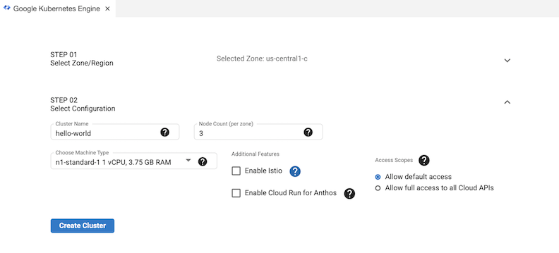
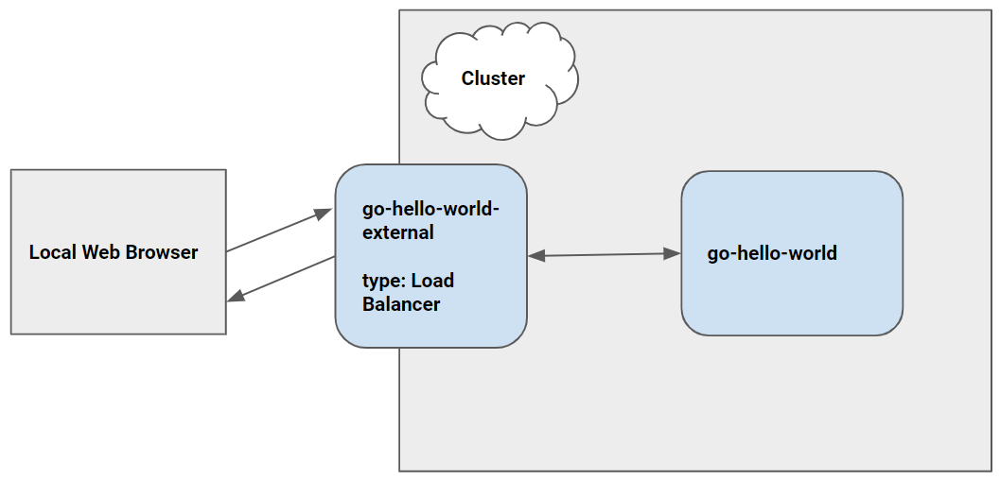

# Guestbook with Cloud Code

The Guestbook sample demonstrates how to deploy a Kubernetes application with a front end service and a back end service using the Cloud Code extension for Cloud Shell. When you run the application, Cloud Code uses [skaffold](https://skaffold.dev/docs/) under the hood to build an image and deploy the project's Kubernetes manifests. To learn more about Kubernetes, explore the [Kubernetes overview](https://kubernetes.io/docs/concepts/overview/).

### Table of Contents
* [Getting Started](#getting-started)
    1. [Run the app locally with minikube](#run-the-app-locally-with-minikube)
    2. [Run the app remotely with Google Kubernetes Engine](#run-the-app-remotely-with-google-kubernetes-engine)
        * [Set up a GKE cluster](#set-up-a-gke-cluster)
        * [Deploy app to GKE](#deploy-app-to-gke)
* [Next steps](#next-steps)
* [Sign up for User Research](#sign-up-for-user-research)
* [Kubernetes Architecture Diagram](#kubernetes-architecture-diagram)

---

## Getting Started

### Run the app locally with minikube

1. To run your application, click on the Cloud Code status bar and select ‘Run on Kubernetes’.  

2. Select ‘Run locally using minikube’ when prompted. Cloud Code runs your app in a local [minikube](https://minikube.sigs.k8s.io/docs/start/) cluster.  

3. If prompted, authorize Cloud Shell to use your credentials to make a GCP API call.  

4. View the build progress in the OUTPUT window. Once the build has finished, click on the front end service's URL in the OUTPUT window to view your live application.  

5.  To stop the application, click the stop icon in the Debug Explorer.  

### Run the app remotely on Google Kubernetes Engine

#### Set up a GKE cluster

1. From the command palette, run "Create GKE cluster".  

2. Follow the steps to configure your cluster and click "Create Cluster". Once your cluster has been created, it will be displayed in the Google Kubernetes Engine Explorer.  

3. Your new cluster will be set as the active cluster by default. To switch clusters, right click on a different cluster in the GKE Explorer and select “Set as Active Cluster”.  

#### Deploy app to GKE

1. Click on the Cloud Code status bar and select ‘Run on Kubernetes’.

2. If prompted, confirm the current context and image registry.  

3. View the build’s progress in the OUTPUT window. Once the build has finished, you can visit your deployed app by clicking the URL in the OUTPUT window.  

---
## Next steps
* Install Cloud Code on your local [VS Code](https://cloud.google.com/code/docs/vscode/install?utm_source=ext&utm_medium=partner&utm_campaign=CDR_kri_gcp_cloudcodereadmes_012521&utm_content=-) or [IntelliJ](https://cloud.google.com/code/docs/intellij/install?utm_source=ext&utm_medium=partner&utm_campaign=CDR_kri_gcp_cloudcodereadmes_012521&utm_content=-) IDE
* Try [debugging your app](https://cloud.google.com/code/docs/vscode/debug?utm_source=ext&utm_medium=partner&utm_campaign=CDR_kri_gcp_cloudcodereadmes_012521&utm_content=-) using Cloud Code
* Navigate the [Kubernetes Engine Explorer](https://cloud.google.com/code/docs/vscode/k8s-overview?utm_source=ext&utm_medium=partner&utm_campaign=CDR_kri_gcp_cloudcodereadmes_012521&utm_content=-)
* Learn how to [edit YAML files](https://cloud.google.com/code/docs/vscode/yaml-editing?utm_source=ext&utm_medium=partner&utm_campaign=CDR_kri_gcp_cloudcodereadmes_012521&utm_content=-) to deploy your Kubernetes app
* [Configure an existing app](https://cloud.google.com/code/docs/vscode/setting-up-an-existing-app?utm_source=ext&utm_medium=partner&utm_campaign=CDR_kri_gcp_cloudcodereadmes_012521&utm_content=-) to run on Cloud Code
* Enable [Cloud APIs and client libraries](https://cloud.google.com/code/docs/vscode/client-libraries?utm_source=ext&utm_medium=partner&utm_campaign=CDR_kri_gcp_cloudcodereadmes_012521&utm_content=-)
* Manage secrets with [Secret Manager](https://cloud.google.com/code/docs/vscode/secret-manager?utm_source=ext&utm_medium=partner&utm_campaign=CDR_kri_gcp_cloudcodereadmes_012521&utm_content=-)

For more Cloud Code tutorials and resources, check out [Awesome Cloud Code](https://github.com/russwolf/awesome-cloudclode)!

---
## Sign up for User Research

We want to hear your feedback!

The Cloud Code team is inviting our user community to sign-up to participate in Google User Experience Research. 

If you’re invited to join a study, you may try out a new product or tell us what you think about the products you use every day. At this time, Google is only sending invitations for upcoming remote studies. Once a study is complete, you’ll receive a token of thanks for your participation such as a gift card or some Google swag. 

[Sign up using this link](https://google.qualtrics.com/jfe/form/SV_4Me7SiMewdvVYhL?reserved=1&utm_source=In-product&Q_Language=en&utm_medium=own_prd&utm_campaign=Q1&productTag=clou&campaignDate=January2021&referral_code=UXbT481079) and answer a few questions about yourself, as this will help our research team match you to studies that are a great fit.

---
## Kubernetes Architecture Diagram

----
